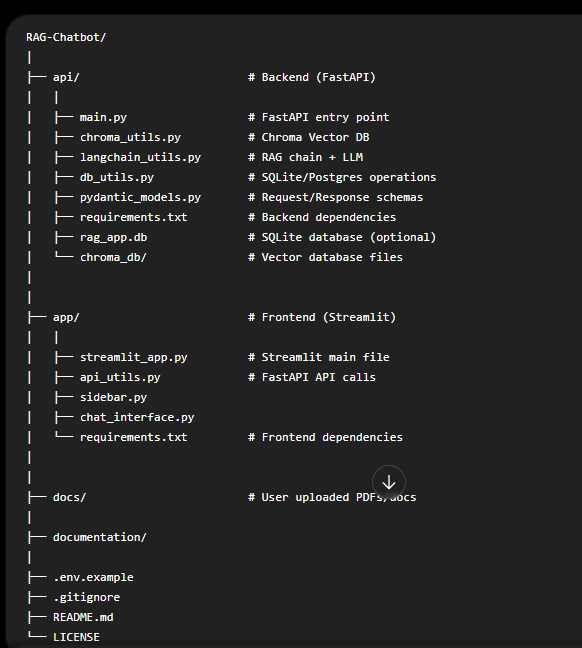
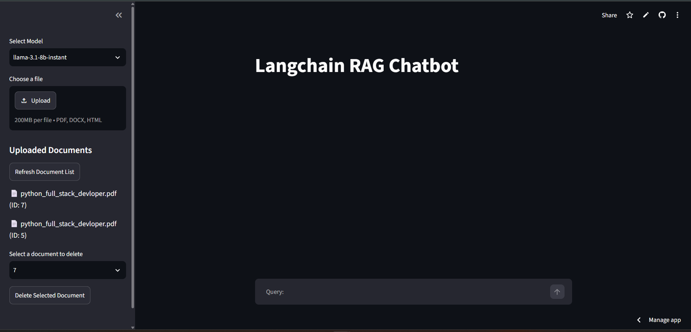
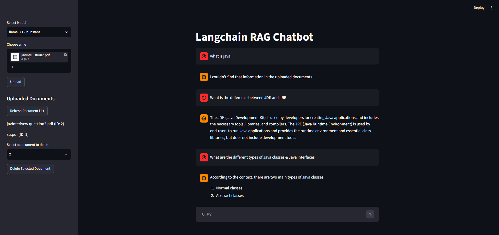
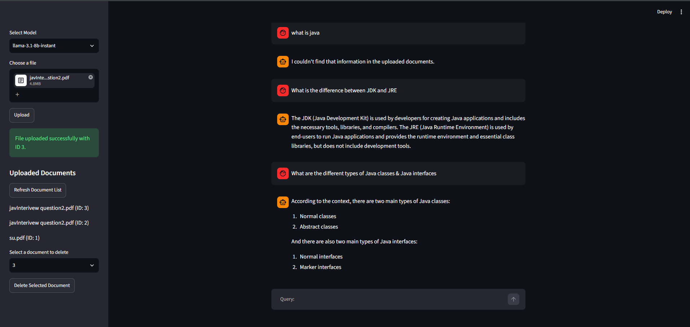

# 🤖 Conversational RAG Chatbot with Memory

An AI-powered conversational chatbot built using **Retrieval Augmented Generation (RAG)** architecture.  
Users can upload documents and ask questions based on the uploaded content. The chatbot retrieves relevant information from documents and generates accurate responses using LLMs.

# 🚀 Features

✅ Upload documents (PDF, DOCX, HTML)  
✅ Ask questions from uploaded documents  
✅ Conversational memory support  
✅ Document based question answering  
✅ Vector similarity search using ChromaDB  
✅ Fast API backend  
✅ Streamlit interactive frontend  
✅ Chat session management  
✅ Document listing and deletion  
✅ LLM integration with Groq models

# 🏗️ Project Architecture

#Screenshots

# 🛠️ Tech Stack

## Backend

- Python
- FastAPI
- Uvicorn
- LangChain
- LangChain Community
- Pydantic
- SQLite

## Frontend

- Streamlit
- Requests

## AI / RAG

- Groq LLM
- LangChain RAG
- ChromaDB
- Vector Embeddings

## Models Used

- llama-3.1-8b-instant
- llama-3.3-70b-versatile

# ⚙️ Installation

## 1. Clone Repository

git clone https://github.com/Sumit-nahire/conversational-rag-chatbot.git

cd conversational-rag-chatbot
Backend Setup

Go inside api folder:

cd api
Create virtual environment:
python -m venv venv
Activate virtual environment:

Windows
venv\Scripts\activate

# Install dependencies:

pip install -r requirements.txt

Create .env file:

GROQ_API_KEY=your_groq_api_key

# Run FastAPI server:

python -m uvicorn main:app --reload

Backend will run:
http://127.0.0.1:8000

Swagger Documentation:
http://127.0.0.1:8000/docs
Frontend Setup

Open another terminal:
cd app

# Create virtual environment:

python -m venv venv

# Activate:

venv\Scripts\activate

Install dependencies:
pip install streamlit requests python-dotenv

Run Streamlit:
python -m streamlit run streamlit_app.py

Frontend URL:
http://localhost:8501

# API Endpoints

Method Endpoint Description
POST /upload-doc Upload documents
GET /list-docs Get uploaded documents
POST /delete-doc Delete document
POST /chat Chat with AI
💬 Application Workflow
User uploads document.
Document text is extracted.
Text is converted into embeddings.
Embeddings are stored in ChromaDB.
User asks a question.
Relevant document chunks are retrieved.
LLM generates the final response.

# Environment Variables

Create .env file:
GROQ_API_KEY=your_api_key
Never upload .env file to GitHub.

# .gitignore

.env
venv/
**pycache**/
_.pyc
chromadb/
_.db

🔮 Future Improvements
User authentication
Cloud deployment
Multiple users support
Chat history storage
Better document processing
Docker deployment
